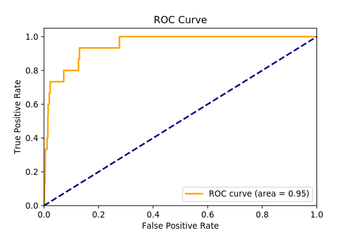

# MLFinalProject
CS 254 Final Project Fall 2019

The ROC Curve for our final model which detects bannable content based on blocks of 200 words extracted from comments. 

## The Project

Socially destructive and unhealthy communities can thrive on social networks, particularly on
Reddit. Reddit is a platform that hosts pages, or subreddits, that are defined by a topic/interest
area where users can post and reply to other posts, creating threads. These topic areas are created
by users, for users, and topics such as fat-shaming, white supremacy, sexual violence, etc, have
taken root into Reddit. Reddit’s response to these communities is to restrict their activity, whether
that be through temporary or permanent bans.

This project creates a model for Reddit’s banning patterns for the purpose of automatic
detection of “bannable” content. We explored various algorithms, units of text, and transformations
to determine the best model for detecting bannable subreddits.

## Data
We used raw Reddit data, aggregated by and downloaded from https://files.pushshift.io.

## Organization
<!-- all scripts and files that were contained in the root directory
before were moved to the scripts directory -->

- `docs` contains the paper written as a result of our work as well as accompanying slides.
- `scripts` contains files related to rank divergence and simple machine learning models which classify subreddits.
- `preprocess` contains scripts used to aggregate, organize, clean, and transform the data into more usable methods for later analyses.
- `exploratory-analysis` contains scripts used to perform exploratory data analysis on the data.
- `csv` contains some datasets that we produced via preprocessing and grouping of the aggregated data.
- `images` contains plots produced as a result of analysis and models
- `models` contains notebooks of all models that we worked with.
- `old-work` contains files that are no longer in use, but we wanted to hold onto.

